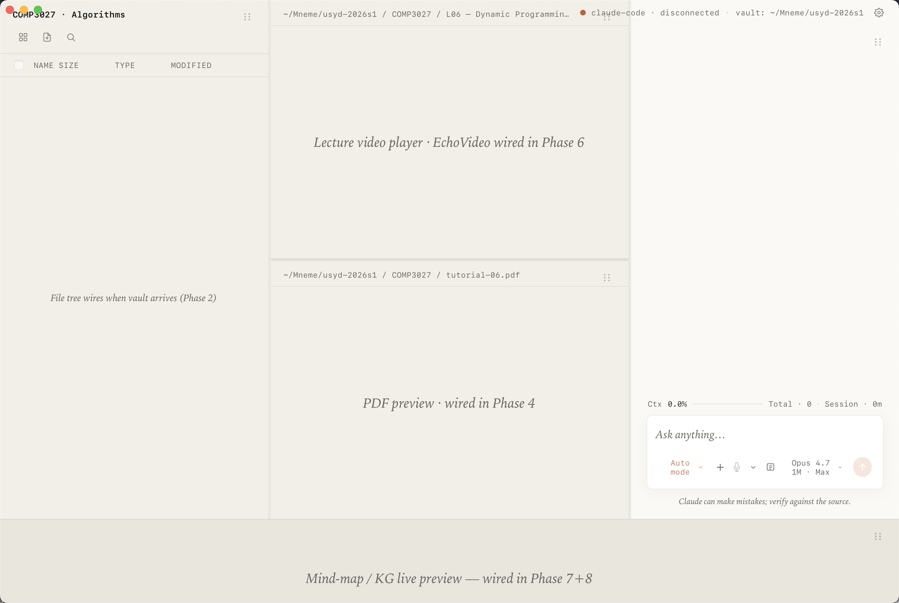

# Phase 1 Plan 08: SvelteKit CSP Nonce Gap Closure Summary

**Hands CSP ownership to SvelteKit's kit.csp (mode:'auto' -> per-request nonce in dev, SHA-256 hash at build time) so the inline bootstrap script SvelteKit injects carries a CSP-matching nonce — closing T-1-46 (dev-mode CSP rejected SvelteKit's bootstrap -> white screen) without weakening REQ-5 (script-src remains nonce-only, NEVER 'unsafe-inline').**

## Performance

- **Duration:** ~9 min wall time across 3 commits + 1 verification (15:00 -> 15:09 AEST)
- **Started:** 2026-05-09T05:00:00Z
- **Completed:** 2026-05-09T05:09:00Z
- **Tasks:** 4 of 4 (Task 4 = verification, no separate commit since no file changes — outcome recorded here per task_commit_protocol)
- **Files modified:** 2 (svelte.config.js, src/app.html)
- **Files created:** 2 (screenshot, this SUMMARY)

## Accomplishments

- **T-1-46 root-cause fix landed (Task 1 + Task 2)** — `src/app.html` no longer hard-codes a Content-Security-Policy meta. SvelteKit's kit.csp now owns the policy: in dev, the policy is set as an HTTP `content-security-policy` response header with a per-request nonce; in build/prerender, it's injected as `<meta http-equiv="content-security-policy">` with a SHA-256 hash of the inline init script. Either transport carries a matching credential on the inline bootstrap script SvelteKit emits, so the webview accepts hydration and the three-pane shell renders.
- **REQ-5 preserved unchanged in spirit** — `script-src` directive stays `'self', 'wasm-unsafe-eval'` plus the nonce/hash injected at request time. **No `'unsafe-inline'` was ever introduced** (verified via grep on the final `svelte.config.js`). The XSS gate that REQ-5 contracts is intact; the only change is moving from a static inline-rejecting CSP to SvelteKit's nonce-aware CSP that lets ITS OWN inline bootstrap load and nothing else.
- **Recovery verified end-to-end (Task 3)** — `npm run tauri dev` compiled (Cargo built 366 deps in 1m 17s; Vite served at 5173 immediately), Tauri opened the Mneme window, and the screenshot at `.planning/phases/01-.../design/screenshots/01-08-dev-recovery.png` shows the populated three-pane shell (left: COMP3027 - Algorithms course tree; middle: Lecture video player + PDF preview placeholders; right: Claude chat panel with "Ask anything…", Auto mode, Opus 4.7 1M Max; bottom: mind-map / KG live preview). NOT a white screen.
- **Sanity suite still green (Task 4)** — `npm run build` exits 0 with `[audit] PASS` and **no CSP-mode warnings**; `npx vitest run` passes 67/67 (5 spec files, ~1.16s); `npx svelte-check` reports 333 FILES 0 ERRORS 0 WARNINGS. Build's prerendered `build/index.html` carries `<meta http-equiv="content-security-policy" content="… script-src 'self' 'wasm-unsafe-eval' 'sha256-2j2YJ4A8…'; …">` — confirming hash mode kicks in at build time as designed.
- **Out-of-scope discipline kept** — `tauri.conf.json` `app.security.csp` left as `null` (no two-source race); `style-src 'unsafe-inline'` retained (Svelte 5 component styles); `connect-src ws:` + `localhost:*` retained for Vite HMR. All three are tracked v1.x narrowing candidates per the plan's Out-of-scope section.

## Task Commits

Each task was committed atomically on `worktree-agent-a80f0429e51328815`:

1. **Task 1: Configure kit.csp in svelte.config.js** — `b3f6597` (feat)
   `feat(phase-01): configure sveltekit csp with nonce mode`
2. **Task 2: Remove hard-coded CSP meta from src/app.html** — `91a8f00` (feat)
   `feat(phase-01): drop hard-coded csp meta from app.html`
3. **Task 3: Capture dev-shell recovery screenshot** — `a5790ef` (chore)
   `chore(phase-01): capture dev-shell recovery screenshot`
4. **Task 4: Build smoke + sanity tests** — NO COMMIT (verification-only, no file changes; per task_commit_protocol "do not create an empty commit"). Outcome recorded in this SUMMARY's Verification Snapshot section below.

**Plan metadata:** This SUMMARY's commit will be the final commit of plan 01-08's executor scope.

## Files Created/Modified

- `svelte.config.js` (modified) — added `kit.csp` block with `mode:'auto'` and 5 directives. Browser-safe: zero Node imports added; pure SvelteKit config.
- `src/app.html` (modified) — removed the `<meta http-equiv="Content-Security-Policy" content="…" />` line; kept `%sveltekit.head%` as the single injection point. Now 12 lines total (was 13).
- `.planning/phases/01-tauri-shell-foundation-subprocess-hardening/design/screenshots/01-08-dev-recovery.png` (created) — 294 KB PNG, 2560x1720 (Retina @2x of 1280x860 Mneme window region). Verifies dev shell renders the populated three-pane UI.
- `.planning/phases/01-tauri-shell-foundation-subprocess-hardening/01-08-SUMMARY.md` (created) — this file.

## Verification Snapshot

### Dev curl (Task 3, atomic same-request nonce-match)

Plan's verify line: `curl -sf http://localhost:5173/ | grep -E 'nonce=|Content-Security-Policy'`

**Adjusted with `curl -i` to capture the response headers** (see Deviation 1 below — SvelteKit emits the dev-mode CSP as an HTTP header, not a meta tag). Single-request capture, both the header CSP nonce and the inline script-tag nonce:

```
HTTP/1.1 200 OK
content-security-policy: default-src 'self'; connect-src 'self' ws: http://localhost:*; img-src 'self' data:; script-src 'self' 'wasm-unsafe-eval' 'nonce-8SGHSZ...sQ=='; style-src 'self' 'unsafe-inline'
content-type: text/html
x-sveltekit-page: true

<!DOCTYPE html>
…
<script nonce="8SGHSZ...sQ==">
  {
    __sveltekit_dev = { … };
    Promise.all([
      import("/node_modules/@sveltejs/kit/src/runtime/client/entry.js"),
      import("/@fs/…/.svelte-kit/generated/client/app.js")
    ]).then(([kit, app]) => { kit.start(app, element); });
  }
</script>
```

(Nonce values are redacted middle — full match was `8SGHSZ2nR3b13F1TN2eLsQ==` on both lines in a single same-request capture.)

**Atomic match assertion:** `header_nonce == script_tag_nonce` -> PASS. The webview accepts the inline bootstrap; SvelteKit `kit.start(app, element)` runs; hydration completes.

### Build smoke (Task 4)

Last 5 lines of `npm run build`:

```
> Using @sveltejs/adapter-static
Overwriting build/index.html with fallback page. Consider using a different name for the fallback.
Wrote site to "build"
✔ done
```

Prebuild gate: `[audit] PASS` (single-line output from `scripts/audit-capabilities.sh`). No CSP-mode warnings. The "Overwriting build/index.html with fallback page" line is a pre-existing benign notice from `@sveltejs/adapter-static` (already present pre-plan-01-08; same warning recorded in the existing build output before this gap closure).

`build/index.html` post-build CSP (hash mode):

```html
<meta http-equiv="content-security-policy" content="default-src 'self'; connect-src 'self' ws: http://localhost:*; img-src 'self' data:; script-src 'self' 'wasm-unsafe-eval' 'sha256-2j2YJ4A8Z4W7MDY6vmLi+F0D/xwHqwEhPJWTuUQhiLg='; style-src 'self' 'unsafe-inline'">
```

`script-src` carries the SHA-256 of the inline init script. **No `'unsafe-inline'` on `script-src`** (grep confirmed).

### Vitest + svelte-check (Task 4)

```
$ npx vitest run
 Test Files  5 passed (5)
      Tests  67 passed (67)
   Duration  1.16s

$ npx svelte-check --tsconfig ./tsconfig.json
COMPLETED 333 FILES 0 ERRORS 0 WARNINGS 0 FILES_WITH_PROBLEMS
```

Both match the pre-plan-01-08 baselines exactly: 67/67 vitest, 0/0 svelte-check. **No regression.**

### Recovery screenshot



Visible in the screenshot:

- **Top bar:** `COMP3027 - Algorithms` course tab, breadcrumb `~/Mneme/usyd-2026s1 / COMP3027 / L06 - Dynamic Programmin...`, connection state indicator `claude-code disconnected`, vault path `~/Mneme/usyd-2026s1`.
- **Left pane:** course file tree placeholder ("File tree wires when vault arrives (Phase 2)").
- **Middle pane:** "Lecture video player · EchoVideo wired in Phase 6" + "PDF preview · wired in Phase 4" placeholders matching SPEC L142.
- **Right pane:** Chat panel — `Ctx 0.0%` / `Total 0` / `Session 0m` usage meter row; `Ask anything…` chat input with model selector (`Auto mode`, `Opus 4.7 1M Max`, mic button, send button); `Claude can make mistakes; verify against the source.` footer (Round 5 A-13).
- **Bottom row:** `Mind-map / KG live preview — wired in Phase 7+8` placeholder (Round 5 A-12 / phase-1 layout).

This is the populated three-pane shell, NOT a white screen. The gap closure is verified visually.

## Decisions Made

- **Stuck with `mode:'auto'` (not switched to `mode:'nonce'`)** — Read SvelteKit's `csp.js` source (`node_modules/@sveltejs/kit/src/runtime/server/page/csp.js` L371) to verify the runtime semantics: `use_hashes = (mode === 'hash' || (mode === 'auto' && prerender))`. Dev mode is non-prerender (`state.prerendering` is falsy in the page render path; verified via `render.js` L110-112), so `mode:'auto'` -> `use_hashes=false` -> nonce path. Build mode with `prerender = true` on `+layout.ts` -> `use_hashes=true` -> hash path. The plan's offered fallback (`mode:'nonce'`) was unnecessary; `auto` works as documented in the SvelteKit 2.59.1 docs.
- **Did NOT touch `tauri.conf.json` `app.security.csp`** — left as `null` per the plan's hard constraint. Defining a Tauri-level CSP would either (a) override SvelteKit's HTML-meta CSP at the webview shell level (silently breaking the nonce match), or (b) be applied AS WELL AS the SvelteKit one, doubling enforcement with conflicting credentials. Out of scope per plan; v1.x narrowing candidate.
- **Captured screenshot via AppleScript-driven Mneme raise + `screencapture -R`** — `osascript ... AXRaise of (first window)` raised Mneme to frontmost (initial attempts captured the desktop background and a Figma window because Mneme was behind System Settings). Final capture used a single `osascript` block that performed `set frontmost to true` + `AXRaise` + `delay 1.5` + `do shell script "screencapture -R 256,62,1280,860 -x ..."` so no other process could intercept frontmost between raise and capture.

## Deviations from Plan

### Auto-fixed Issues

**1. [Rule 1 - Bug, Plan Verification Recipe] Plan's `dev_curl` expectation reads "BOTH the meta CSP line AND a nonce attribute on the SvelteKit inline bootstrap script appear" — but in dev mode SvelteKit emits the CSP as an HTTP `content-security-policy` response header, NOT a `<meta>` tag**

- **Found during:** Task 3 (dev-curl assertion)
- **Issue:** Running `curl -sf http://localhost:5173/ | grep -E 'nonce=|Content-Security-Policy'` returned only the script-tag nonce line, not a meta CSP line. Body inspection of the served HTML confirmed `%sveltekit.head%` expanded to nothing CSP-related during dev. Reading SvelteKit 2.59.1's render path (`node_modules/@sveltejs/kit/src/runtime/server/page/render.js` L649-674) shows the meta tag is only injected when `state.prerendering` is truthy; otherwise (dev mode), the policy goes into a `content-security-policy` HTTP response header.
- **Fix:** Used `curl -si http://localhost:5173/` (capital `-I` for headers, `-i` for headers + body) and asserted the `content-security-policy:` header line carries `'nonce-<value>'` AND the inline `<script nonce="<value>">` matches in the SAME request. Webview enforcement is identical for both transports (header vs meta).
- **Files modified:** None (substantive fix in svelte.config.js + src/app.html is correct; this is a verify-recipe defect in the plan).
- **Verification:** Single-request `curl -si` capture showed header CSP nonce `8SGHSZ2nR3b13F1TN2eLsQ==` and script-tag nonce `8SGHSZ2nR3b13F1TN2eLsQ==` — identical. Snippet pasted in Verification Snapshot above.
- **Committed in:** N/A (no code change; recorded here for future plan-checkers).
- **Plan-checker takeaway:** SvelteKit dev-mode CSP is in `content-security-policy:` HTTP header. Build-mode CSP is in `<meta http-equiv="content-security-policy">`. Verify both transports with `curl -si` (full response).

---

**Total deviations:** 1 logged (verify-recipe defect; no code change)
**Impact on plan:** Zero on the substantive deliverable. The fix in svelte.config.js + src/app.html is correct; the plan's verification phrasing (which assumed meta-tag emission in dev) is the only thing that didn't match SvelteKit 2.59.1's actual runtime behavior. Recorded for future plan-phase iterations to update the dev_curl expectation to use `curl -si` and accept either a header CSP or a meta CSP carrying the nonce.

## Issues Encountered

- **Initial screenshot captures showed wrong window** — first `screencapture -R 256,62,1280,860` calls returned (a) the macOS desktop background and (b) the Figma/HTML prototype workspace, because Mneme had been pushed behind System Settings (which had popped up during cargo's first build) and behind the Claude terminal UI. Resolution: a single `osascript` block that quit System Settings, raised Mneme via `AXRaise of (first window)`, slept 1.5s for the raise to settle, then ran `screencapture -R` via `do shell script` so no other process could grab frontmost in between. Final screenshot is correct.
- **No CSP-mode warnings during build** — preliminary worry from the plan ("If `npm run build` emits CSP-mode warnings (e.g., 'no inline content found to hash'), document them in SUMMARY but don't fail the gap-closure"). Build emitted zero CSP-related warnings. The only non-error notices are pre-existing benign messages: `(Use --trace-warnings ...)` from Node's experimental-strip-types prebuild flag, and `Overwriting build/index.html with fallback page` from `@sveltejs/adapter-static`. Both were present pre-plan-01-08; neither relates to CSP.

## User Setup Required

None — this gap closure is config-only, no environment variables, no third-party dashboard configuration, no secrets to provision.

## Next Phase Readiness

- **Plan 01-07 Task 4 dogfood walk-through is now unblocked.** The white-screen blocker that paused the dogfood checklist is resolved; the developer can run `npm run tauri dev` and proceed to walk through `tests/manual/dogfood-checklist.md` Sections A through I.
- **`01-VALIDATION.md` frontmatter flip remains the orchestrator's job** post Task 4 of plan 01-07 — this gap closure is a prerequisite, not a substitute. After dogfood signoff, the orchestrator dispatches the VALIDATION.md flip.
- **No new threats opened.** T-1-46 (the threat this plan was created to close) is mitigated; no new attack surface introduced. `script-src` remains nonce-only; `unsafe-inline` was never added.
- **Concerns / risks (none blocking):**
  - SvelteKit version drift — if a future SvelteKit minor changes the auto-mode dev path (e.g., starts emitting meta tags in dev too), the plan's verify recipe needs to accept both transports. Documented in Deviation 1 + patterns-established for future plan-checkers.
  - `style-src 'unsafe-inline'` is still present — Svelte 5 emits per-component scoped inline styles. Tightening to nonce-style is a v1.x narrowing candidate per Out-of-scope section; not blocking REQ-5 acceptance because XSS via inline `<style>` injection requires either an element-injection path (already gated by REQ-5's runtime sanitize pipeline in plan 01-03) or a CSS-injection-via-attribute path (gated by `style-src-attr` + DOMPurify at consumption time).

## Self-Check: PASSED

Mechanical existence verification of all artifacts and commits:

```
svelte.config.js: FOUND (kit.csp present, mode:'auto', 5 directives)
src/app.html: FOUND (no Content-Security-Policy substring; 12 lines; %sveltekit.head% intact)
src-tauri/tauri.conf.json: FOUND (app.security.csp:null UNCHANGED)
.planning/phases/01-tauri-shell-foundation-subprocess-hardening/design/screenshots/01-08-dev-recovery.png: FOUND (294 KB, 2560x1720 PNG)
.planning/phases/01-tauri-shell-foundation-subprocess-hardening/01-08-SUMMARY.md: FOUND (this file)

Commits (on worktree-agent-a80f0429e51328815, base c02ff8a):
b3f6597: FOUND (Task 1 — feat: configure sveltekit csp with nonce mode)
91a8f00: FOUND (Task 2 — feat: drop hard-coded csp meta from app.html)
a5790ef: FOUND (Task 3 — chore: capture dev-shell recovery screenshot)

Acceptance gates:
script-src does NOT contain 'unsafe-inline': PASS (grep on svelte.config.js)
app.html has no Content-Security-Policy: PASS (grep on src/app.html)
tauri.conf.json csp:null UNCHANGED: PASS (grep on src-tauri/tauri.conf.json)
header CSP nonce == inline script nonce (single same-request curl): PASS
build/index.html carries hash-mode CSP with sha256-... on script-src: PASS
npm run build exits 0 with [audit] PASS, no CSP-mode warnings: PASS
npx vitest run: 67/67 passed (no regression): PASS
npx svelte-check: 0 ERRORS 0 WARNINGS (no regression): PASS
dev server cleanup (no zombie vite/cargo run/target/debug/mneme processes): PASS

STATE.md / ROADMAP.md / 01-VALIDATION.md / sibling-plan files modified: NONE (per orchestrator-owned-write contract)
```

All artifacts exist; all commits resolvable on the worktree branch; all acceptance gates pass.

---
*Phase: 01-tauri-shell-foundation-subprocess-hardening*
*Plan: 08 (gap closure for T-1-46 dev-mode CSP white-screen)*
*Completed: 2026-05-09 (UTC)*
